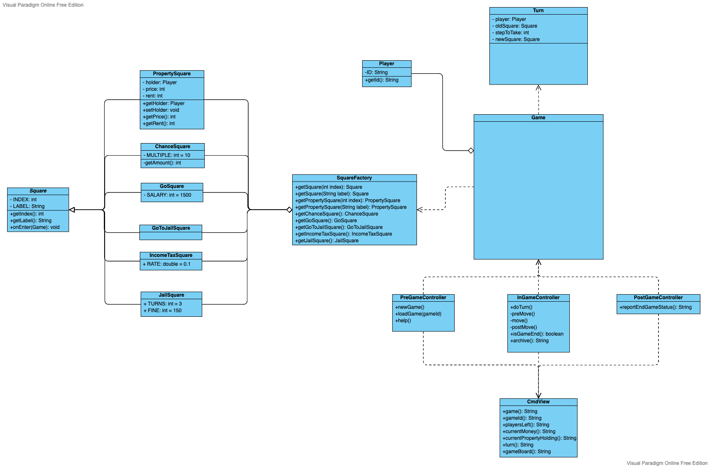
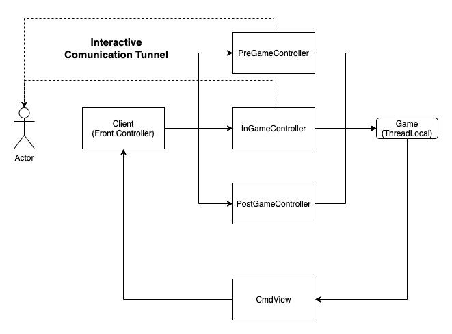
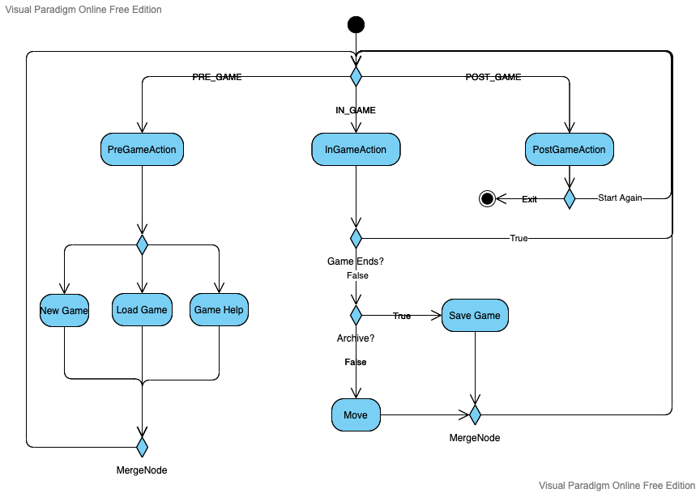
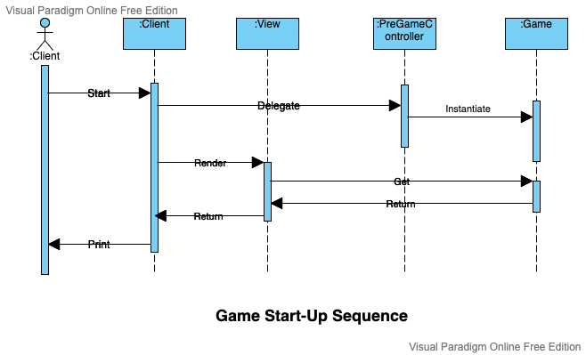
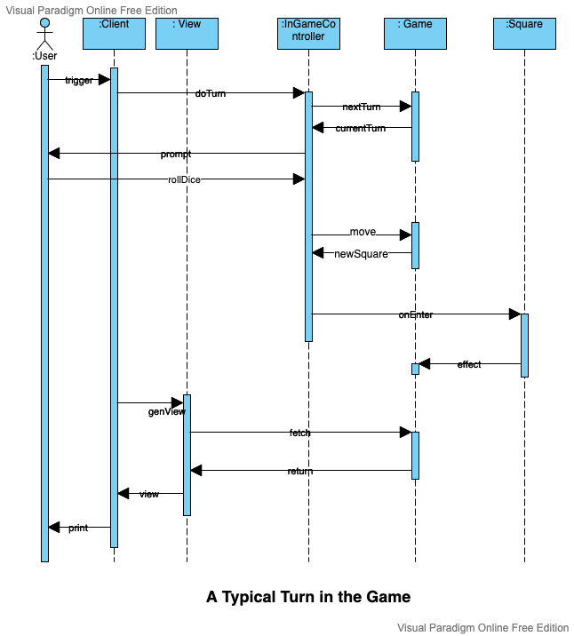
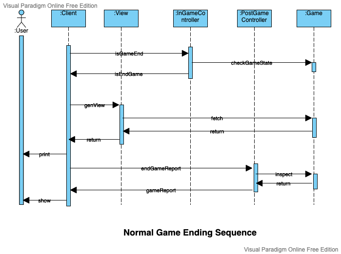

# Design

## Fundamental Abstractions

A `Player` represents a player of the game. Each player in the same game owns a unique id.

A `Turn` encapsulates information for each turn in a game, such as whose turn this is, the initial square of this player, how many steps to be taken, and the destination square. It is *clock* of the game. The notion of a `Turn` in only meaningful in the context of a `Game`

A `Game` is a play of the Monopoly Game. Note that the following information is sufficient to determine the game state:

* Players of the game
* Scores of the players
* Mapping from player to their square
* Property holding status
* The game time, elapsed and current

The game progresses by `Turn`.

A `Square` represent a square on the game board. The determining characteristic of a `Square` is its effect on the game state when a user lands on it. `Square`s are managed by the `SquareFactory`.

Below is a UML diagrams illustrating the classes in our implementation.

## MVC Architecture

Users first and foremost talks to the Front Controller (FC), FC monitors the game state and invoke the corresponding controller. There are three designated controllers, one for each game state. They receive user input and update the current `Game`. FC then renders the game through the `CmdView` engine and print the game view to the user.

It is worth pointing out the FC is not the only place where the system interacts with user. The controllers can also read user input and output response when needs arise, for example, the `InGameController` can ask user whether he wants to purchase the property directly without the need to go through FC.

The diagram below is a simplified illustration.

## System Behaviour

### Overview of Program Activities

The program is in one of the three states: `PRE_GAME`, `IN_GAME` and `POST_GAME`, each state offers a different set of activities to end users. The diagram below presents a simplified activity view.

### Game Start

After the user triggers the game to start (either by starting a new game, or by loading an existing game), the `Client` (`FrontController`) delegates the operation to `PreGameController` to instantiate a `Game` object, which will be used throughout. After the creation is complete, the `Client` will instructs the `View` to render the game. The returned game view is then printed back to the user. See the sequence diagram below for an illustration.

### Game Turn

The following diagram represents a typical `Turn` in the game. A `Turn` starts when the last `Turn` finishes (The first `Turn` starts when the game is loaded). The `FrontController` instructs the `InGameController` to perform a `Turn`. `InGameController` fetches the current `Turn` (game clock time) from the `Game`. Typically, the next operation is to ask the user to draw the dices to determine how many steps she should move. An exception could be that the current user is in jail. After obtaining the `stepToMove`, the `InGameController` updates the `Game` model by: 1) instructs the `Game` to move the player to a new `Square`; 2) carry out the `Square`'s effect (e.g., if the square is "GoToJail", the effect would be to put the current player in jail). In the end, the game view is updated and printed out.

### Game End

A normal (as opposed to, for example, when the user forcefully quits the game) end game sequence is triggered when `Client` detects that the game is in the `END_GAME` status. The system first prints out the game view. Then, `Client` instructs `PostGameController` to report the game ending status which is then presented to the players.

## Mics

`ThreadLocal<Game>`: `GameHolder` is thread local and can be accessed anywhere in the same thread at runtime. This reduces the explicit and sometimes unnecessary coupling of the essential model with controllers and views (e.g., by passing a game instance at the object construction time)

`Interactive Communication Tunnel`: The interaction of controller with users can be conducted in a virtual tunnel that bypasses the FC. This is due to the observation that some operation must be carried out in an *atomic* way. I/O via the FC would otherwise be inefficient and unnecessarily increases complexity. Currently, the raw `System.in` and `System.out` is used for read and write. Alternatively, an abstraction maybe used, for example, `Tunnel` that exposes the read/write interface.

`Square.onEnter(Game)`: This decision concerns where to put the logic that handles a player's entrance on a particular square (e.g., the property square, where a user can buy or must pay rent). The intuition is to model it as a method in `Square` as it is indeed a `Square`'s behaviour. Most generally, a `Sqaure`'s entrance behavior affects the game state, for example, a player is put into the jail.

Singleton `Square` subclasses: Since the squares of the Monopoly Game are pre-determined and won't change during the course of the game, any `Square` instance only needs to be present once in the memory. A `SquareFactory` is used to generate and store these `Sqaure` singletons. This increases memory efficiency. Also, since we know subclasses of `Square` will only ever be instantiated once, we can in turn make them anonymous.